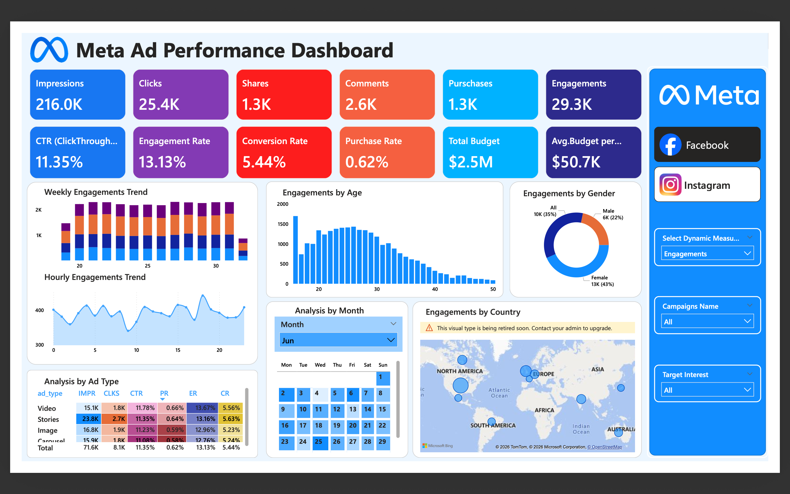
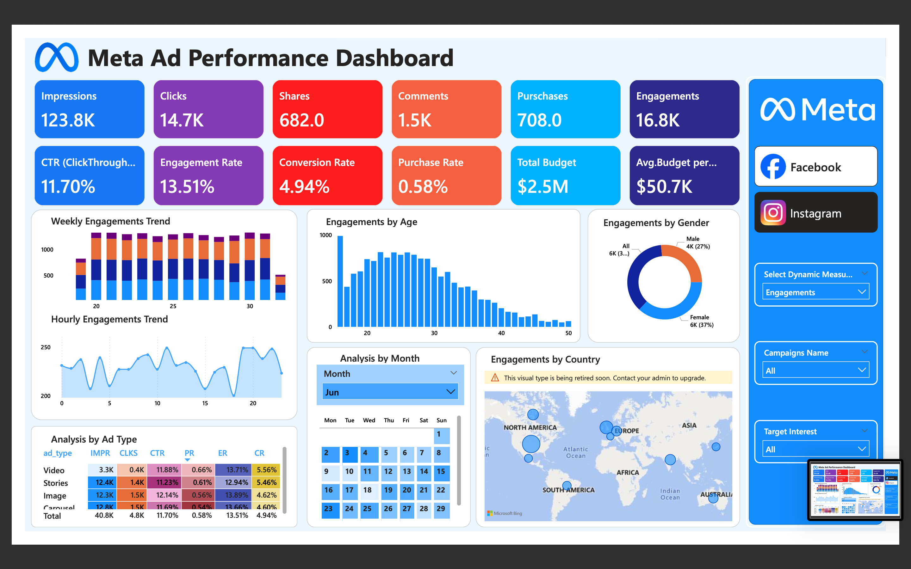

# Meta Ads Performance Dashboard (Power BI)

A comprehensive **Power BI dashboard** built to analyze and optimize **Meta (Facebook & Instagram) advertising performance** across the entire marketing funnel — from awareness to conversion.

---

## Project Objective

- Track and compare **Facebook vs Instagram ad performance**
- Analyze audience behavior (age, gender, geography)
- Identify funnel drop-offs from clicks to purchases
- Generate **actionable insights** to improve ROI

This dashboard is suitable for **marketing teams, performance analysts, and decision-makers**.

---
## Dashboard Screenshots

> All screenshots are stored inside the `Dashboard/` folder.

## KPI Definitions (What Each KPI Means)

| KPI | Meaning |
|----|--------|
| **Impressions** | Total number of times an ad was shown to users. Measures reach and brand visibility. |
| **Clicks** | Number of times users clicked on the ad. Indicates interest in the ad content. |
| **Shares** | Number of times users shared the ad. Reflects organic reach and content virality. |
| **Comments** | User responses on ads. Indicates audience interaction and sentiment. |
| **Engagements** | Total interactions including clicks, likes, shares, and comments. |
| **CTR (Click-Through Rate)** | Percentage of impressions that resulted in clicks. Measures ad attractiveness. |
| **Engagement Rate** | Percentage of users who engaged with the ad. Shows content relevance. |
| **Purchases (Conversions)** | Number of completed purchases driven by ads. Represents business outcomes. |
| **Conversion Rate** | Percentage of clicks that resulted in purchases. Measures landing page effectiveness. |
| **Purchase Rate** | Percentage of impressions that resulted in purchases. Indicates funnel efficiency. |
| **Total Budget** | Total advertising spend across campaigns. |
| **Avg Budget / Campaign** | Average spend per campaign. Shows campaign distribution strategy. |

---
## 📌 Platform-wise KPI Performance

### Facebook Ads Performance

| KPI | Value |
|----|------|
| Impressions | 216K |
| Clicks | 25.4K |
| Shares | 1.3K |
| Comments | 2.6K |
| Engagements | 29.3K |
| Purchases | 1.3K |
| CTR | 11.35% |
| Engagement Rate | 13.13% |
| Conversion Rate | 5.44% |
| Purchase Rate | 0.62% |
| Total Budget | $2.5M |
| Avg Budget / Campaign | $50.7K |

**Insight:**  
Facebook delivers **higher reach and conversion volume**, making it ideal for **scaling campaigns and awareness-focused strategies**.

---

###  Instagram Ads Performance

| KPI | Value |
|----|------|
| Impressions | 123.8K |
| Clicks | 14.7K |
| Shares | 682 |
| Comments | 1.5K |
| Engagements | 16.8K |
| Purchases | 708 |
| CTR | 11.70% |
| Engagement Rate | 13.51% |
| Conversion Rate | 4.94% |
| Purchase Rate | 0.58% |
| Total Budget | $2.5M |
| Avg Budget / Campaign | $50.7K |

**Insight:**  
Instagram shows **slightly better engagement efficiency**, but lower conversion volume due to reduced reach.

---

## 📈 Funnel Comparison Insights

- Both platforms have **very high CTR (~11–12%)**, well above industry benchmarks
- Facebook drives **more purchases due to higher impressions**
- Instagram excels in **engagement quality**
- Low purchase rate on both platforms indicates **lower-funnel optimization issues**

**Conclusion:**  
- Facebook → Best for **scale and conversions**  
- Instagram → Best for **engagement and creative impact**

---

## 👥 Audience Insights

### Engagement by Gender
- Females show the **highest engagement** on both platforms
- Males show moderate engagement

**Action:**  
Design **female-focused creatives**, especially for Instagram.

---

### Engagement by Age Group
- Highest engagement: **18–30 years**
- Engagement declines sharply after **35+**

**Primary Target Audience:** Young adults (early 20s)

---

## 🌍 Geographic Performance

Top engaged countries:
- United States
- India
- Brazil
- Germany
- United Kingdom

**Strategy:**
- Scale campaigns in **India & US**
- Run high-conversion campaigns in **Germany & UK**

---

## ⏱️ Time-Based Trends

### Weekly Trend
- Stable engagement throughout the month
- No major performance drop-offs

### Hourly Trend
- Peak engagement: **15:00–20:00**
- Lowest engagement: **00:00–05:00**

**Action:**  
Schedule ads during **afternoon and evening hours**.

---

## Ad Format Performance

| Ad Format | Performance Insight |
|---------|-------------------|
| Video | Highest CTR, engagement, and conversion |
| Stories | Strong reach and engagement |
| Carousel | Moderate performance |
| Image | Lowest conversion efficiency |

**Best Formats:**  
**Video > Stories > Carousel > Image**

---

##  Tools & Technologies Used

- Power BI
- DAX
- Data Modeling
- Marketing Analytics
- Data Visualization

---
